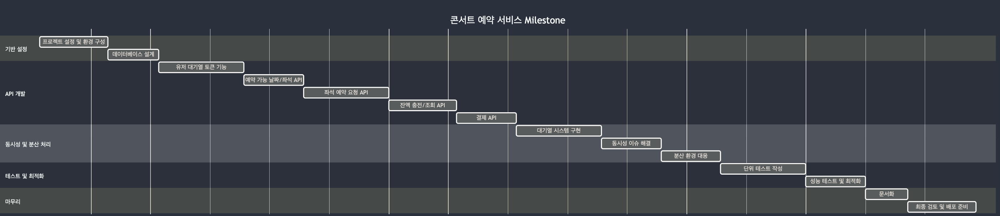
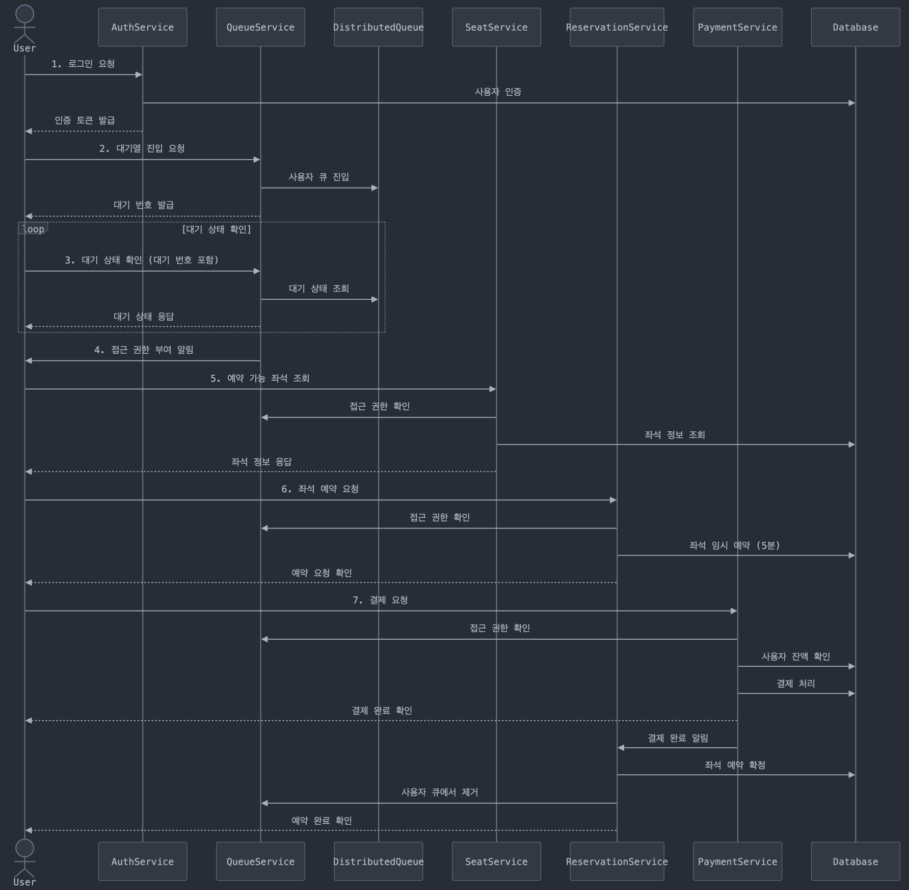

STEP 05
- 시나리오 :  콘서트 예약 서비스

프로젝트 Milestone

1. 기반 설정
- 프로젝트 설정 및 환경 구성: 개발 환경 설정, 필요한 라이브러리 설치 등
- 데이터베이스 설계: 사용자, 좌석, 예약, 결제 정보 등을 저장할 DB 스키마 설계

2. API 개발
- 요구사항에 맞춰 5개의 주요 API를 순차적으로 개발
- 각 API 개발 후에는 기본적인 테스트 수행

3. 동시성 및 분산 처리
- 대기열 시스템 구현: 사용자 요청을 관리하고 처리하는 대기열 시스템을 구축
- 동시성 이슈 해결: 여러 사용자가 동시에 접근할 때 발생할 수 있는 문제 해결

4. 테스트 및 최적화
- 단위 테스트 작성: 각 기능 및 제약사항에 대한 단위 테스트를 작성합니다.

5. 마무리
- 문서화: API 문서, 시스템 구조도 등 필요한 문서를 작성합니다.

 
 

시퀀스 다이어그램

1. 로그인 요청
- 로그인을 요청
- 사용자 정보를 확인하고 인증
- 인증이 성공하면 User에게 인증 토큰을 발급

2. 대기열 진입 요청
- 대기열 진입을 요청
- 분산 큐 시스템에 사용자를 등록
- User에게 대기 번호를 발급

3. 대기 상태 확인 (루프)
- User는 주기적으로 자신의 대기 상태를 확인 요청
- 현재 대기 상태를 조회
- User에게 현재 대기 상태를 응답
- 이 과정은 사용자의 차례가 될 때까지 반복

4. 접근 권한 부여
- 사용자의 차례가 되면, User에게 접근 권한 부여를 알립니다.

5. 예약 가능 좌석 조회
- User가 예약 가능한 좌석 정보를 요청합니다.
- 사용자의 접근 권한을 확인
- 좌석 정보를 조회합니다.
- User에게 좌석 정보를 응답

6. 좌석 예약 요청
- User가 특정 좌석 예약을 요청
- 사용자의 접근 권한을 다시 확인
- Database에 해당 좌석을 5분간 임시 예약 상태로 설정
- User에게 예약 요청 확인을 응답

7. 결제 요청
- User가 결제를 요청
- 사용자의 접근 권한을 확인
- Database에서 사용자의 잔액을 확인
- 결제를 처리하고 Database에 결과를 기록
- User에게 결제 완료를 확인
- 결제 완료를 알립니다.

8. 예약 확정
- Database에서 좌석 예약을 확정 상태로 변경
- 해당 사용자를 큐에서 제거하도록 요청
- User에게 최종적으로 예약 완료를 확인